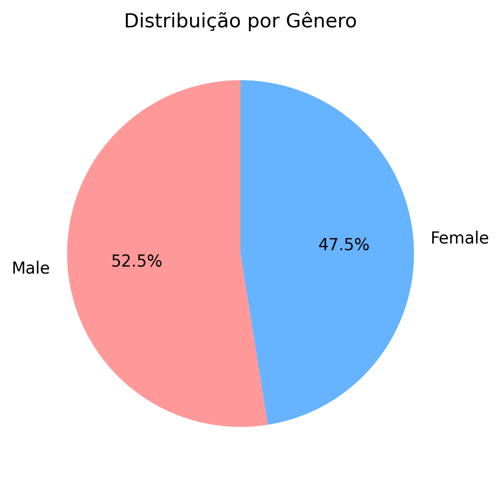
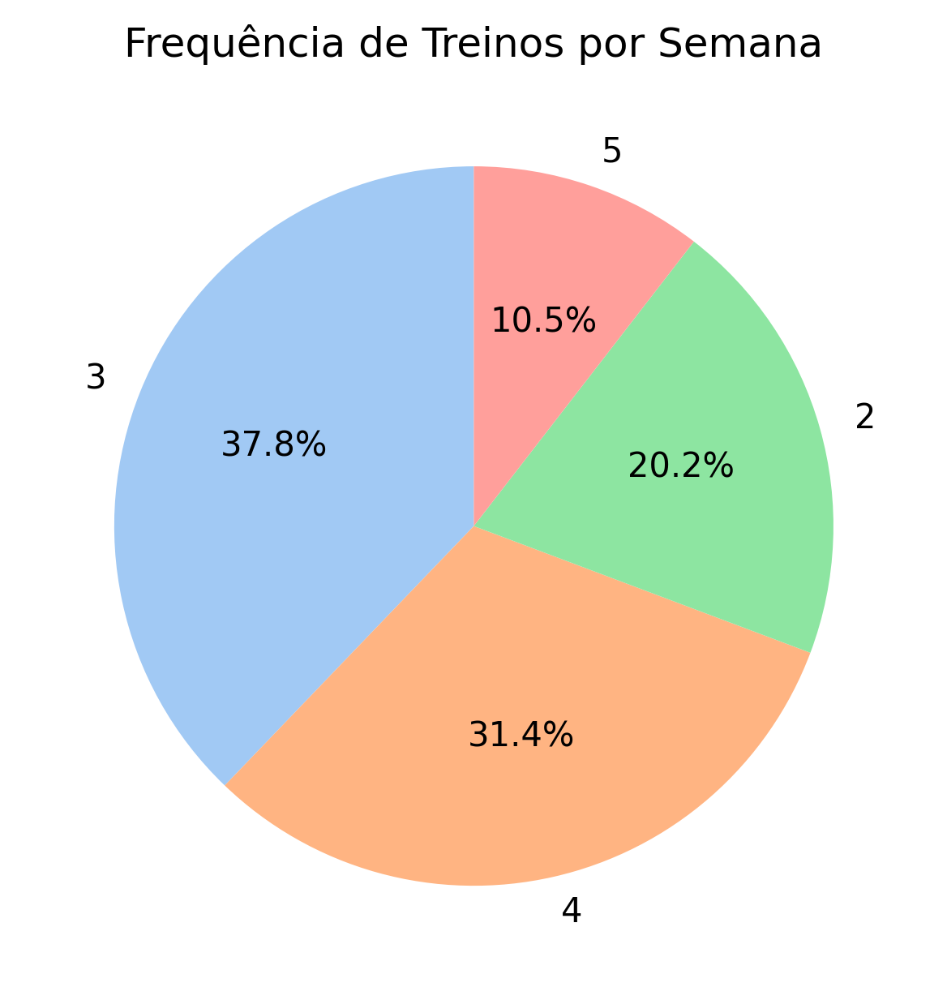
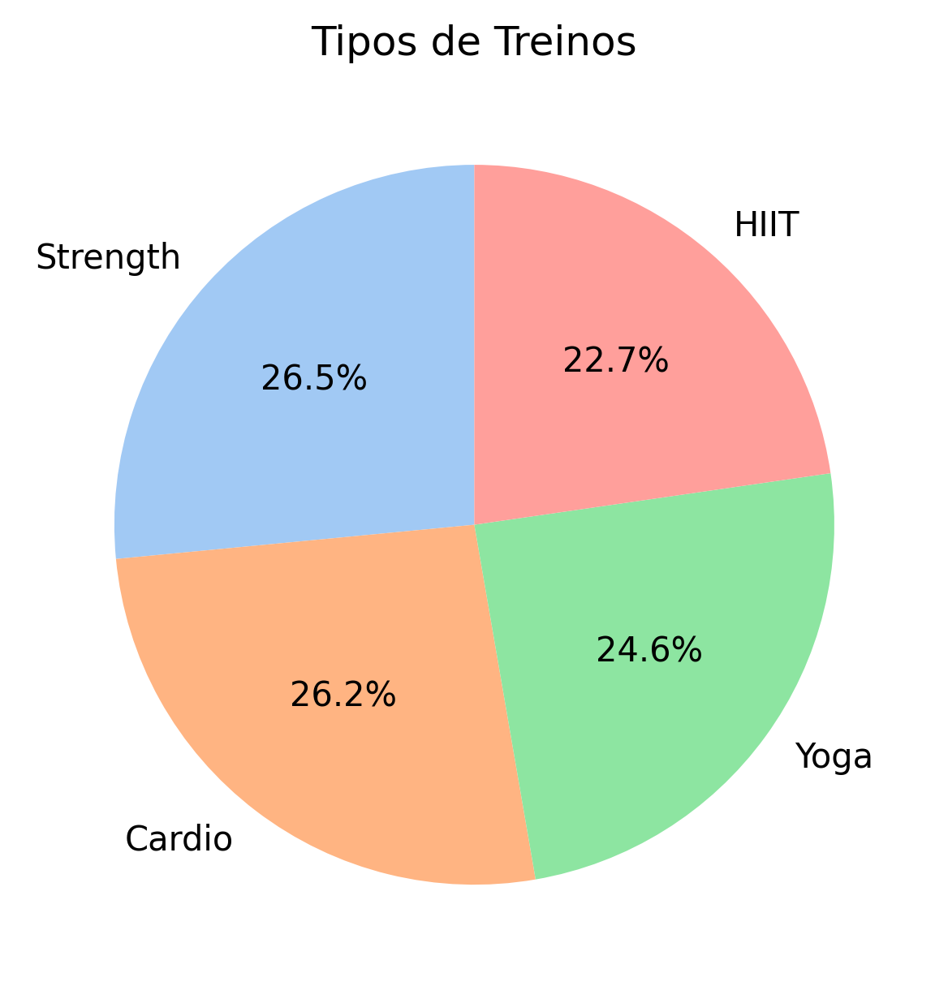
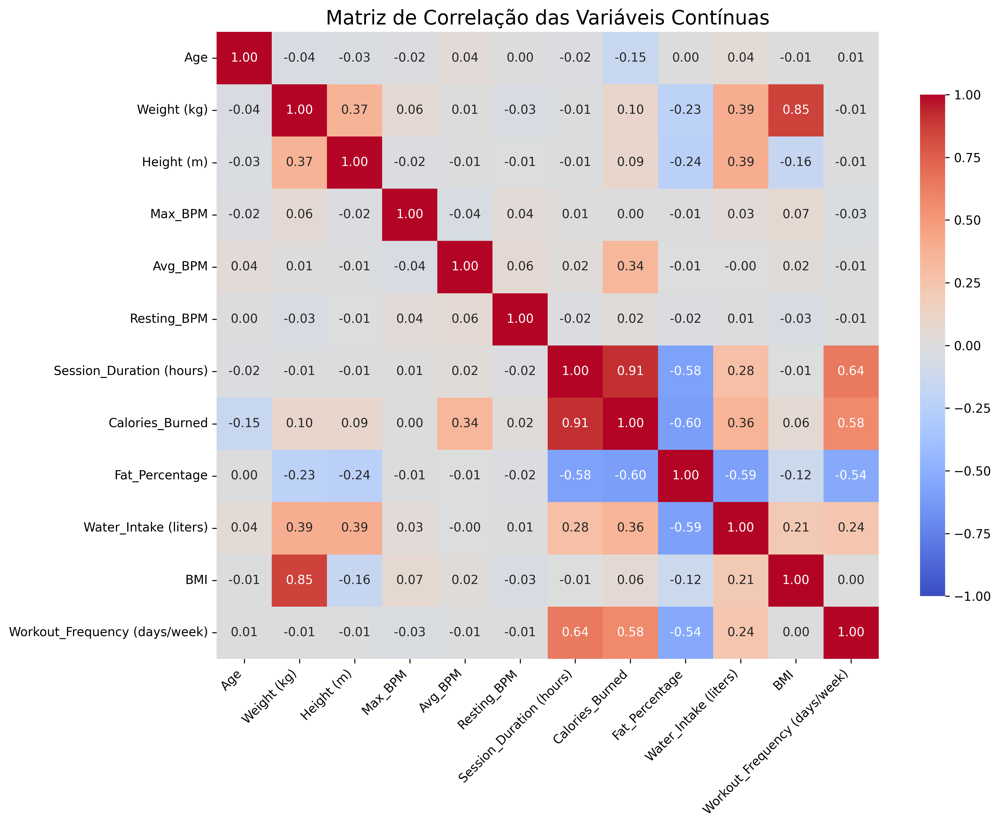

## 🔍 Análise Exploratória

Antes de realizar o pré-processamento dos dados, foi realizada uma análise exploratória para observar insights importantes relacionados ao negócio. Nesta etapa, gráficos foram gerados para entender a distribuição e correlações entre as variáveis.

### 1. Distribuição de Variáveis Categóricas e Contínuas

Os seguintes gráficos foram gerados e salvos no diretório `figures`:

#### Gráfico 1: Proporção por Gênero
```python
gender_counts = data['Gender'].value_counts()
gender_counts.plot(kind='pie', autopct='%1.1f%%', startangle=90, colors=['#ff9999', '#66b3ff'])
plt.title('Distribuição por Gênero')
plt.ylabel('')  # Remove o rótulo do eixo Y
plt.savefig(os.path.join(output_dir, 'proporcao_genero.png'), dpi=300, bbox_inches='tight')
plt.close()
```

#### Gráfico 2: Frequência de Treinos por Semana
```python
frequency_counts = data['Workout_Frequency (days/week)'].value_counts()
frequency_counts.plot(kind='pie', autopct='%1.1f%%', startangle=90, colors=sns.color_palette('pastel'))
plt.title('Frequência de Treinos por Semana')
plt.ylabel('')
plt.savefig(os.path.join(output_dir, 'frequencia_treinos.png'), dpi=300, bbox_inches='tight')
plt.close()
```

#### Gráfico 3: Tipos de Treinos
```python
workout_type_counts = data['Workout_Type'].value_counts()
workout_type_counts.plot(kind='pie', autopct='%1.1f%%', startangle=90, colors=sns.color_palette('pastel'))
plt.title('Tipos de Treinos')
plt.ylabel('')
plt.savefig(os.path.join(output_dir, 'tipos_treinos.png'), dpi=300, bbox_inches='tight')
plt.close()
```

### 2. Análise de Variáveis Contínuas

#### Histogramas das Variáveis Contínuas
```python
columns_to_plot = ['Age', 'Fat_Percentage', 'Session_Duration (hours)', 'Calories_Burned']
colors = ['blue', 'green', 'orange', 'purple']

for column, color in zip(columns_to_plot, colors):
    sns.histplot(data[column], kde=True, color=color, bins=20)
    plt.title(f'Histograma de {column.replace("_", " ")}')
    plt.xlabel(column.replace('_', ' '))
    plt.ylabel('Frequência')
    plt.tight_layout()
    file_name = f'histograma_{column.lower().replace(" ", "_").replace("(", "").replace(")", "")}.png'
    plt.savefig(os.path.join(output_dir, file_name), dpi=300, bbox_inches='tight')
    plt.close()
```

#### Matriz de Correlação
```python
continuous_columns = ['Age', 'Weight (kg)', 'Height (m)', 'Max_BPM', 'Avg_BPM',
                      'Resting_BPM', 'Session_Duration (hours)', 'Calories_Burned',
                      'Fat_Percentage', 'Water_Intake (liters)', 'BMI', 'Workout_Frequency (days/week)']

corr_matrix = data[continuous_columns].corr()

plt.figure(figsize=(12, 10))  # Aumenta o tamanho da figura
sns.heatmap(corr_matrix, annot=True, cmap='coolwarm', fmt='.2f', vmin=-1, vmax=1, cbar_kws={'shrink': 0.8})
plt.title('Matriz de Correlação das Variáveis Contínuas', fontsize=16)
plt.tight_layout()
plt.xticks(rotation=45, ha='right')
plt.savefig(os.path.join(output_dir, 'matriz_correlacao.png'), dpi=300, bbox_inches='tight')
plt.close()
```

### 📁 Exemplos de Gráficos Gerados

#### Proporção por Gênero


#### Frequência de Treinos por Semana


#### Tipos de Treinos


#### Matriz de Correlação


---

# Clustering de Peso e Gordura Corporal

Este projeto aplica técnicas de **Machine Learning** para realizar **detecção de outliers** e **clustering** de dados relacionados a peso e percentual de gordura corporal. O objetivo é identificar padrões nos dados, agrupando-os em clusters e removendo anomalias para obter resultados mais precisos.

## 📋 Funcionalidades

1. **Encoding de variáveis categóricas** para facilitar o uso de algoritmos de machine learning.
2. **Detecção e remoção de outliers** utilizando o modelo **Isolation Forest**.
3. **Normalização e escalonamento dos dados** com o **StandardScaler**.
4. **Clustering** dos dados de peso e gordura corporal com o algoritmo **KMeans**.
5. **Visualização** dos clusters em um gráfico.

## 🚀 Tecnologias Utilizadas

- **Python**
- **Bibliotecas**:
  - `pandas` para manipulação de dados.
  - `numpy` para operações numéricas.
  - `matplotlib` para visualização.
  - `scikit-learn` para modelagem (Isolation Forest, KMeans e escalonamento).

## 📂 Estrutura do Código e Trechos Relevantes

### 1. **Pré-processamento: Encoding de Variáveis**

- **Encoding de dados categóricos**:
  Antes de aplicar o pipeline, as variáveis categóricas são transformadas em colunas binárias ou numéricas para que os algoritmos possam processá-las. Por exemplo, a coluna `Workout_Type` foi subdividida em múltiplas colunas, uma para cada tipo de treino.

  ```python
  data['Gender'] = LabelEncoder().fit_transform(data['Gender'])
  data['Experience_Level'] = LabelEncoder().fit_transform(data['Experience_Level'])
  data = pd.get_dummies(data, columns=['Workout_Type'], drop_first=False)
  ```

Esse processo facilita o treinamento de modelos como o **Isolation Forest** e o **KMeans**.

### 2. **Detecção e Remoção de Outliers**

- **Escalonamento dos dados contínuos** antes da detecção de outliers para garantir que todas as variáveis tenham a mesma escala:

  ```python
  scaler_before_outlier = StandardScaler()
  scaled_continuous_data = scaler_before_outlier.fit_transform(data[continuous_columns])
  ```

- **Aplicação do modelo Isolation Forest** para identificar e remover outliers:

  ```python
  isolation_forest = IsolationForest(random_state=42, contamination=0.05)
  outlier_pred = isolation_forest.fit_predict(scaled_continuous_data)

  data['Outlier'] = outlier_pred
  cleaned_data = data[data['Outlier'] == 1].drop(columns=['Outlier'])
  cleaned_data = cleaned_data.reset_index(drop=True)
  ```

### 3. **Clustering de Peso e Gordura**

- **Seleção e escalonamento das variáveis de peso e gordura** após a remoção de outliers:

  ```python
  peso_gordura_columns = ['Weight (kg)', 'Fat_Percentage']
  cleaned_peso_gordura_data = cleaned_data[peso_gordura_columns]

  scaler_after_outlier = StandardScaler()
  scaled_cleaned_peso_gordura_data = scaler_after_outlier.fit_transform(cleaned_peso_gordura_data)
  ```

- **Aplicação do KMeans** para agrupar os dados em clusters:

  ```python
  kmeans_cleaned_peso_gordura = KMeans(n_clusters=3, random_state=42)
  cleaned_data['Peso_Gordura_Cluster'] = kmeans_cleaned_peso_gordura.fit_predict(scaled_cleaned_peso_gordura_data)
  ```

- **Reconversão dos dados escalonados para os valores originais**:

  ```python
  original_cleaned_peso_gordura_data = scaler_after_outlier.inverse_transform(scaled_cleaned_peso_gordura_data)
  cleaned_data['Peso_Original'] = original_cleaned_peso_gordura_data[:, 0]
  cleaned_data['Gordura_Original'] = original_cleaned_peso_gordura_data[:, 1]
  ```

### 4. **Visualização dos Clusters**

O gráfico gerado exibe os clusters identificados com base nos dados sem outliers:

```python
plt.figure(figsize=(10, 6))
plt.scatter(cleaned_data['Peso_Original'], cleaned_data['Gordura_Original'], c=cleaned_data['Peso_Gordura_Cluster'], cmap='viridis')
plt.xlabel('Peso (kg)')
plt.ylabel('Percentual de Gordura')
plt.title('Clusters de Peso e Gordura (Sem Outliers)')
plt.colorbar(label='Cluster')
plt.show()
```


